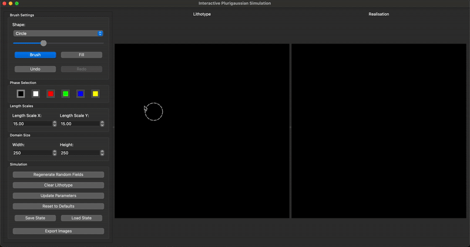

# Interactive Plurigaussian Simulation

An interactive desktop application for exploring Plurigaussian Simulation (PGS) in geostatistical modeling, designed for educational and research purposes.



## Description

This tool provides an intuitive interface for understanding and experimenting with Plurigaussian Simulation, a powerful geostatistical method used in subsurface modeling and geological characterisation. The application allows users to interactively define lithotypes and observe how they influence the realisations through real-time visualisation.

## Purpose

The primary objective of this tool is to facilitate the exploration and understanding of lithotype relationships in geostatistical simulations. It serves as:

- **Educational Resource**: Provides hands-on experience with PGS to understand the influence of lithotype morphology
- **Research Tool**: Enables rapid prototyping and testing of lithotype configurations
- **Visualisation Platform**: Offers real-time feedback on the relationship between lithotype constraints and simulated fields

## Features

### Interactive Modeling Environment
- **Real-time Simulation**: Instantaneous PGS updates as lithotypes are modified
- **Multi-phase Support**: Work with up to 5 categorical phases with distinct visual representation
- **Advanced Drawing Tools**: Multiple brush shapes (circle, triangle, square) with adjustable sizes (1-75)
- **Fill Tool**: Rapid lithotype assignment using flood-fill algorithms
- **Brush Preview**: Real-time cursor preview showing exact brush size and shape
- **Undo/Redo System**: Full history tracking with 20-step undo/redo capability

### Professional Workflow Features
- **Save/Load State**: Complete project persistence to JSON files
- **Export Functionality**: Save lithotype and realization images as high-quality PNG files
- **Reset to Defaults**: One-click restoration of all parameters to default values
- **Parameter Management**: Batch parameter updates with single "Update Parameters" button

### Geostatistical Controls
- **Adjustable Correlation Lengths**: Independent control of X and Y direction correlation scales (1.0-100.0)
- **Domain Size Configuration**: Customisable grid dimensions (50x50 to 500x500)
- **Random Field Regeneration**: Sample new realisations while maintaining lithotype constraints
- **Parameter Persistence**: All settings preserved across save/load operations

## Installation

### Prerequisites
- Python 3.9 or higher
- Use of a virtual environment is recommended 

### Dependencies
The application requires the following Python packages:
- `PyQt5` - GUI framework
- `gstools` - Geostatistical simulation library
- `numpy` - Numerical computing

### Setup Instructions

1. **Clone the repository**:
   ```bash
   git clone https://github.com/your-username/interactive-plurigaussian-simulation.git
   cd interactive-plurigaussian-simulation
   ```

2. **Create a virtual environment** (conda is used here):
   ```bash
   conda create -n pgs-interactive
   conda activate pgs-interactive
   ```

3. **Install dependencies**:
   ```bash
   pip install -r requirements.txt
   ```

4. **Run the application**:
   ```bash
   python app/main.py
   ```

##  Getting Started
1. Launch the application to see the default 250x250 grid with 5 phases
2. Select a phase (0-4) from the coloured buttons in the control panel
3. Choose your drawing tool (Brush or Fill) and brush shape (Circle, Triangle, Square)
4. Draw lithotype patterns on the left "Lithotype" canvas
5. Observe real-time PGS simulation results on the right "Realisation" canvas

### Keyboard Shortcuts
- `Ctrl+Z`: Undo last action
- `Ctrl+Y`: Redo last undone action

## Contributing

Contributions are welcome.

## License

This project is licensed under the MIT License - see the LICENSE file for details.

## Citation

If you use this tool in your research or educational activities, please consider citing this repository in your work.

## Acknowledgments

This tool was developed to support geoscience education and research in geostatistical modeling. It builds upon the excellent GSTools library for the underlying simulation capabilities.
